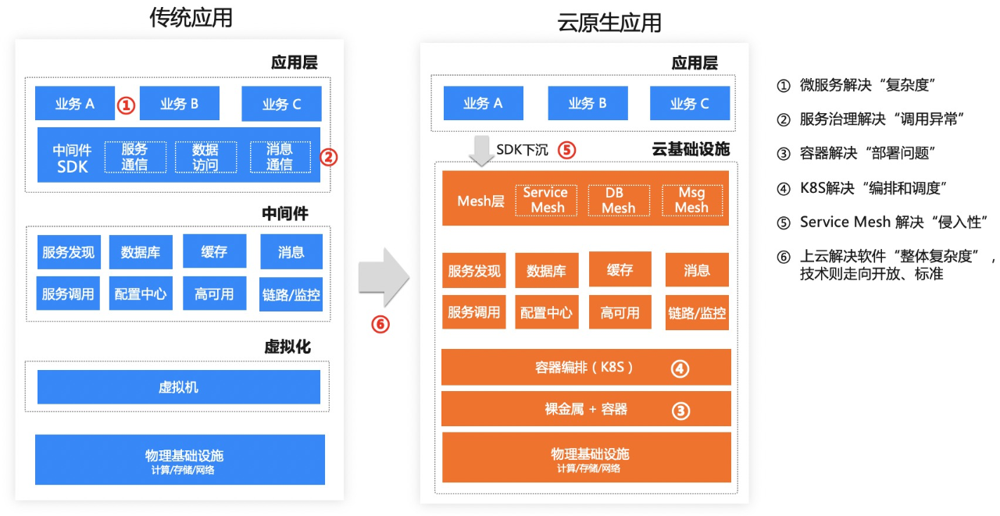

# 云原生是什么？

## 1 业界对于云原生的定义
总结下来，业界对于云原生涉及的范围大致会定义在4个方面：

1. 方法论和设计原则：
   1. 12 factor +3
   2. 微服务架构模式
   3. 声明式 API
   4. 不可变基础设施
2. 技术和架构：
   1. 微服务架构
   2. 服务网格
   3. Serverless
   4. 容器和容器编排
3. 流程规范
   1. DevOps
   2. CI/CD
4. 基础设施和工具
   1. 云服务：如RDS、S3
   2. 以容器技术为基础的云原生基础设施
   3. Kubernetes、Docker、Helm
   4. Etcd
   5. OPA、Hydra
   6. Prometheus
   7. Istio

下面看看一些具有代表性的公司和组织对于「云原生」相关的定义。

### 1.1 Gartner
_**18 February 2020，《Hype Cycle for Cloud Computing, 2019》**_

如果某事物是为利用云特征而创建的，则它被认为是云原生的。

这些云特征是云计算最初定义的一部分，并且包括作为服务交付的功能，这些功能具有可伸缩性和弹性，通过使用进行计量，基于服务，在互联网技术中无处不在并共享。

术语“云原生”主要用作形容词。 例如，您可以拥有云原生架构，基础架构，应用程序或操作。

整理定义并明确目标是利用云原生的关键。普遍使用三种相互矛盾的定义：

1. 第一含义是最常见的。 基本上，将云原生解释为原生使用云平台功能。 因此，例如它可以是平台即服务，可用性区域或无服务器。 因此，如果您使用的是Amazon，那么您将使用AWS的本机功能，例如RDS，Lambda和Beanstalk。
2. 第二个含义是关注特定技术，例如容器和Kubernetes。 这由名为Cloud Native Computing Foundation（CNCF）的组织推动，该组织推广了这些技术。
3. 第三种含义是本质上具有架构意义的含义。 其中一个来源是GTP的LIFESPAR缩写。 另一个示例是12因子应用程序。 这种方法在那些非常了解架构方法的人中很流行，但绝不是该术语的最常见用法。

### 1.2 CNCF
_**2018-06-11，《CNCF Cloud Native Definition v1.0》**_

云原生技术有利于各组织在公有云、私有云和混合云等新型动态环境中，构建和运行可弹性扩展的应用。云原生的代表技术包括容器、服务网格、微服务、不可变基础设施和声明式API。

这些技术能够构建容错性好、易于管理和便于观察的松耦合系统。结合可靠的自动化手段，云原生技术使工程师能够轻松地对系统作出频繁和可预测的重大变更。

云原生计算基金会（CNCF）致力于培育和维护一个厂商中立的开源生态系统，来推广云原生技术。我们通过将最前沿的模式民主化，让这些创新为大众所用。

### 1.3 Pivotal (VMware)

云原生是一种方法，用于构建和运行充分利用云计算模型优势的应用。

云计算不再将重点放在资本投资和员工上来运行企业数据中心，而是提供无限制的按需计算能力和根据使用情况付费的功能，从而重新定义了几乎所有行业的竞争格局。

IT 开销减少意味着入行的壁垒更低，这一竞争优势使得各团队可以快速将新想法推向市场，这就是软件正在占据世界，并且初创公司正在使用云原生方法来颠覆传统行业的原因。

但是，企业需要一个用于构建和运行云原生应用和服务的平台，来自动执行并集成 DevOps、持续交付、微服务和容器等概念。

### 1.4 RedHat
#### **什么是云原生应用？**
云原生应用是独立的小规模松散耦合服务的集合，旨在提供备受认可的业务价值，例如快速融合用户反馈以实现持续改进。简而言之，通过云原生应用开发，您可以加速构建新应用，优化现有应用并在云原生架构中集成。其目标是以企业需要的速度满足应用用户的需求。

#### **云原生应用中的“云”指的是什么？**
如果应用是「云原生应用」，那么它专门用于跨私有云、公共云和混合云提供始终如一的开发与自动管理体验。企业采用云计算来提高应用的可扩展性与可用性。通过自助服务和按需置备资源、自动执行从开发到生产的应用生命周期，企业可以获得这些优势。

但是，要想充分利用这些优势，需要一种新的应用开发形式。

例如云原生开发，通过这种方式，可以快速构建和更新应用，同时提高质量并降低风险。具体来说，无论在公共云、私有云还是混合云，您都可以构建和运行可扩展的响应式容错应用。

#### **如何构建云原生应用？**
首先从您企业中的人员和帮助他们开展协作的自动化流程入手。也就是说，通过 DevOps 使您的开发和运维团队协同合作，让他们朝着共同目标努力并定期进行反馈。

容器提供理想的应用部署单元和独立的执行环境，为这些实践提供支持。凭借 DevOps 和容器，您能更加轻松地以松散耦合服务的形式（如微服务）来发布和更新应用，而不是等待大型版本的发布。

云原生开发注重架构的模块性、松散耦合及其服务的独立性。每个微服务实现一种业务能力，在自己的流程中运行，并通过应用编程接口（API）或消息传递进行通信。该通信可通过服务网层进行管理。

但是，作为云原生应用的一部分，您无需始终从微服务开始以加速应用交付。许多企业仍然可以使用基于服务的实用架构来优化其传统应用。持续整合和持续部署（CI/CD）等 DevOps 工作流以及全自动部署操作为该优化提供支持。

## 2 云原生技术解决的问题
云原生架构解决应用的核心技术问题是：可移植性、可扩展性、可靠性和可维护性(易用性)。

云原生让云计算标准化、降低大规模自动化运维门槛：

* 通过「容器」技术标准化应用分发和应用交付，解耦应用与底层运行环境
* 通过「Kubernetes」标准化资源调度和资源编排，屏蔽底层架构差异
* 通过「微服务架构」标准化应用架构抽象，解耦业务与技术
* 通过「服务网格」标准化服务通信和服务治理

* 为了解决单体架构应对业务的「复杂度问题」，使用微服务架构，标准化应用架构抽象、解耦业务与技术。
* 为了解决微服务间「通讯管理和异常处理问题」，使用服务治理框架 + 日志、监控、链路跟踪。
* 为了解决微服务架构下大量应用「部署问题」，使用容器，标准化应用分发与交付、解耦微服务与底层运行环境。
* 为了解决容器的「编排和调度问题」，使用 Kubernetes，标准化资源调度与编排、屏蔽底层架构差异。
* 为了解决微服务框架的「侵入性问题」，使用 Service Mesh，标准化服务通信与治理。
* 为了让 Service Mesh 有「更好的底层支撑」，将 Service Mesh 运行在 k8s 上。
* 为了解决应用「持续交付问题」，引入了 Devops。

以上是从技术角度来定义的「云原生」

## 3 云原生发展史

详细内容见我的另外一篇文章 [《云原生发展史》](../timelines/cloudnative-timeline.md)

## 4 我对于云原生的理解

* 云原生是云计算的延伸，云原生以云计算为基础，云原生是云计算的新阶段。
* 从利益相关者的角度来看，云原生涉及的利益相关者范围包括：
  * 云基础设施提供商(私有云、公有云)
  * 数字化转型的企业
  * IT技术开发者(或技术爱好者)
* 从发展趋势来看，云原生已经从关注技术，发展到关注商业价值和产业落地；圈子的发展已经从开源/技术社区、互联网企业、大型企业，发展到中小企业、传统企业等。
* 从基础设施的角度来看，云计算基础设施关注资源，云原生时代的云原生基础设施关注应用，即从「以资源为中心」演进到「以应用为中心」。
* 从技术角度来看，云原生像其他技术体系概念一样，涉及到架构、理念、组件、技术等4个方面：
  * 架构：微服务架构、12因素...
  * 理念：不可变基础设施、声明式设计、DevOps、GitOps...
  * 组件：Docker、Kubernetes...
  * 技术：容器、微服务...
* 从技术生态角度来看，云原生技术生态已经在爆发式增长。从早期的容器、微服务、DevOps等领域，扩展到几十个细分领域，包括应用定义、服务网格、可观测性、云原生数据库、消息中间件等。从CNCF的 Landscape 来看，已经有1000+的开源和商业化的项目。
* 从商业角度来看，云原生是产业数字化转型和创新的新基建和加速器，服务于数字化转型的企业/开发者。在资源利用、环境适应性、业务连续性、交付效率等方面为客户降本增效，让客户专注于自身业务的价值挖掘。
* 云原生解决的核心问题：
  * 为数字化转型的企业组织，提供管理数字化系统的复杂度的能力，让组织能够专注于自身的业务价值。这些复杂性体现在这些数字化系统应对环境变化、需求变化、业务规模增长等方面。
  * 为云基础设施提供商提供新的思路，细化产业分工，专注资源价值、能力价值：
    * 资源价值：提供高效、低成本的资源
    * 能力价值：提供生于云、长于云的软件架构、交付和运维体系
  * 并不解决这些数字化系统最终使用者的使用体验和业务能力问题，这些是数字化转型企业的业务范畴。
