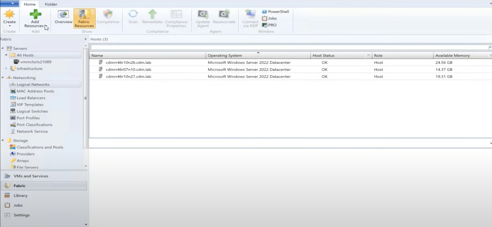
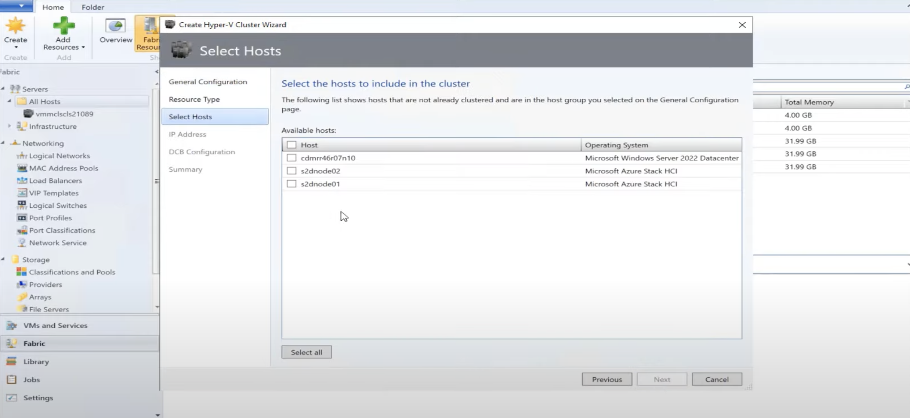
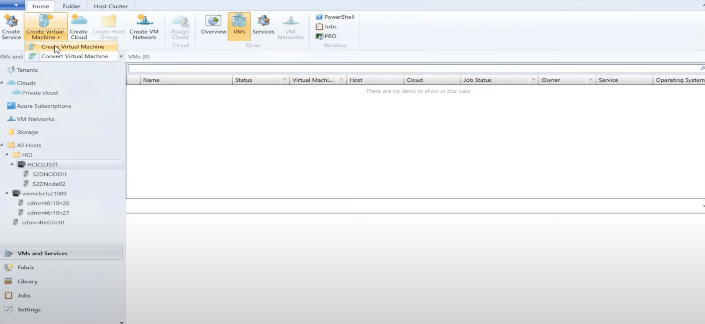
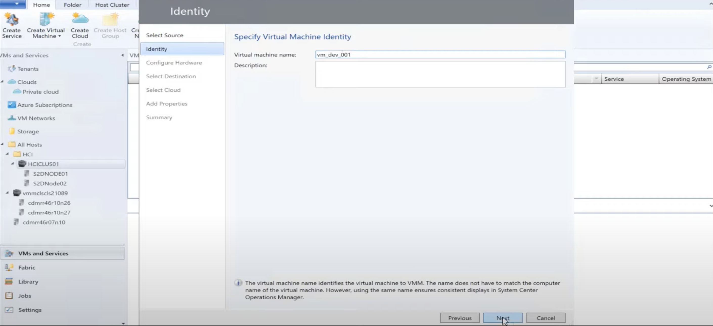
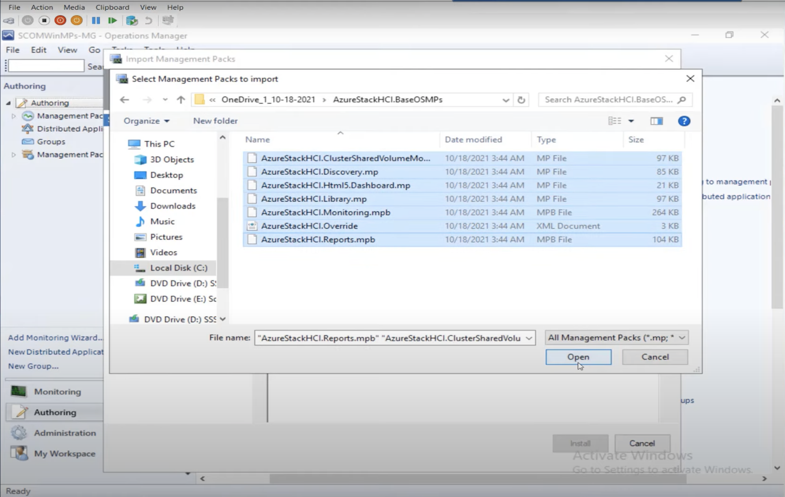
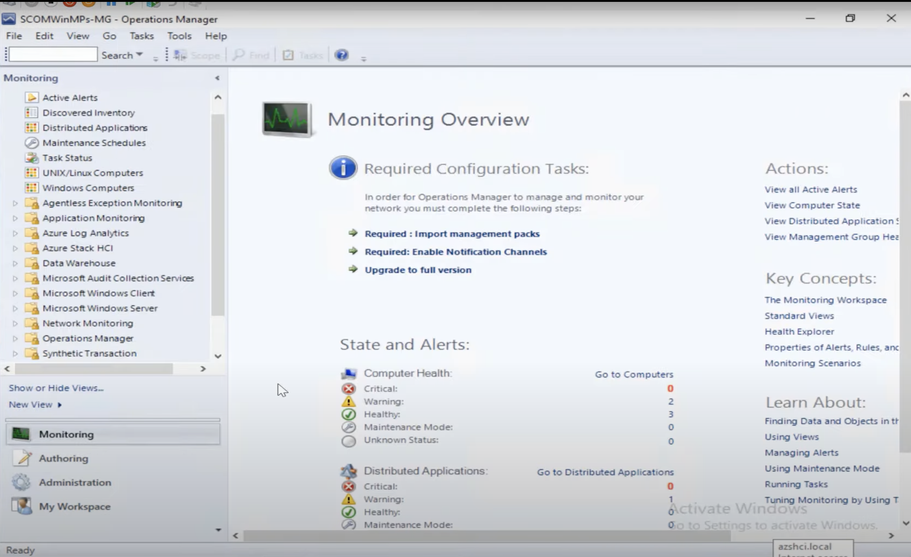

## 1 背景
对于运行关键任务工作负载的企业而言，数据中心是任何 IT 基础架构的核心部分。

当今的组织正在采用混合云来扩展其 IT 基础架构，以获得更好的灵活性和可扩展性。企业正在寻找能够实现这些优势的综合基础设施管理解决方案，包括共享资源以及按需扩展和缩减的弹性以满足不断变化的业务需求——最大限度地减少停机时间和故障，同时最大限度地提高成本效率。
通过将传统数据中心转变为私有云，可以更加敏捷并更有效地管理资源。还可以通过混合云模型将数据中心扩展到公共云。

随着计算、网络和存储组件以及云技术的进步，数据中心环境的管理可能很快变得复杂。

使用传统的基础架构管理，IT 团队总是面临交付 IT 资源以满足不断变化的业务需求的压力。 随着不同的项目和部门需求，包括短期和长期，交付 IT 资源的成本日益增加，并影响业务收入模式。如果没有适当的解决方案，基础设施运营和管理可能会变得复杂且效率低下。

## 2【目标用户定位】System Center 的使用者是谁？
企业系统管理员，准确的说是有着管理现代 IT 数据中心需求的企业系统管理员。

## 3【产品定位&核心目标】System Center 解决什么问题？
Microsoft System Center 是一个服务器产品套件，或者说是工具集，专门用于帮助企业系统管理员简化数据中心管理：使用 System Center 管理跨平台和跨环境的 IT 资产，简化基础架构和虚拟化软件定义数据中心的部署、配置、管理和监控，同时提高敏捷性和性能。

## 4【价值】为什么选择 System Center？
一流的数据中心管理：使用 System Center 管理跨环境和跨平台的 IT 资产，可以更好地控制环境管理

灵活地管理异构基础设施平台：统一管理 Windows Server、SQL Server、Linux、Azure Stack HCI、VMware 和 Hyper-V 上的工作负载

使用 Azure 进行混合管理：在不减慢开发人员创新速度的情况下有效管理分布在不同地点的 IT 资源是 IT 领导者当今面临的一项关键挑战。使用 Azure Arc 能够从单个控制平面跨本地、多个云和边缘无缝治理、管理和保护 Windows 和 Linux 服务器、Kubernetes 集群和应用程序。

## 5【使用场景】System Center 提供了哪些场景解决方案？
通过基础架构配置降低复杂性：跨计算、网络、存储和安全性无缝部署、配置和管理软件定义的数据中心基础架构。此外，还可以利用云就绪的 Windows Server 功能，包括 Nano Server、受保护的虚拟机以及高效的软件定义网络和存储解决方案。
通过自动化流程和自助服务提高效率：使用内置的编排和 IT 服务管理自动化任何数据中心任务以减少错误并提高速度。通过直观的 Web 门户和高效的服务管理提供自助服务功能。
基础设施监控。通过工作负载和基础架构监控获得所需的洞察力：监控运行状况、容量和使用情况，以诊断和解决应用程序、工作负载和基础架构中的问题，以免导致代价高昂的停机或性能下降。使用与 Azure 安全和管理的本机集成访问丰富的分析和见解。

## 6【产品特性-功能/非功能】System Center 包含哪些关键能力？

每个关键场景和由一个工具来实现关键能力提供支持：
1. Infrastructure provisioning(Deploy)
2. Infrastructure monitoring
3. Automation
4. Backup(Data Protect)
5. IT Service Management
6. 注：Configuration Manager转到了 Microsoft Endpoint Manager这个品牌，不再属于 Microsoft System Center

## 7【产品架构-组件组成】System Center 的组成包含哪些内容？
Microsoft System Center 2022 包括： 
* System Center Operations Manager (SCOM)：Operations Manager 是 Microsoft System Center 的一个组件，也是一款帮助你从单一控制台中监视许多计算机的服务、设备和操作的软件。如果在环境中使用 Operations Manager，则可以更加轻松地监视多个计算机、设备、服务和应用程序。 使用 Operations Console 可以检查环境中所有监视对象的运行状况、性能和可用性，并有助于确定和解决问题。
* Virtual Machine Manager (VMM)：VMM 是 Microsoft System Center 的一个组件，用于配置、管理和转换传统数据中心，并帮助提供跨本地、服务提供商和 Azure 云的统一管理体验
* System Center Orchestrator (SCORCH)：SCORCH 是 Microsoft System Center 的一个组件。作为 IT 管理员，你可能会执行大量任务和过程，使计算环境保持正常。 你可能具有自动化的各个任务，但通常不是整个过程。 借助 System Center Orchestrator，可以使用图形用户界面 Runbook Designer 将不同的任务和过程捆绑在一起，以便在 IT 环境中创建可靠、灵活且高效的端到端解决方案。 使用 Orchestrator，可以在你的数据中心中实现流程自动化，而不考虑硬件或平台；可以标准化最佳做法以提高运营效率；可以连接来自不同供应商的系统，而无需知道如何使用脚本和编程语言。
* Service Manager (SM)：提供了一个集成平台，用于自动化和调整组织的 IT 服务管理最佳做法，例如在 Microsoft Operations Framework (MOF) 和信息技术基础结构库 (ITIL) 中找到的最佳做法。 它提供了用于解决事件和问题、控制更改以及管理资产生命周期的内置过程。
* Data Protection Manager (DPM)：是一个可靠的企业备份和恢复系统，通过推进企业数据的备份和恢复来支持 BCDR 策略。
* *Configuration Manager (SCCM)：从版本1910开始，Configuration Manager是 Microsoft Endpoint Manager 的一部分，不再属于 Microsoft System Center。Microsoft Endpoint Manager是一个新的品牌*。

**这些管理工具/服务，都可以独立安装、升级，并且都有独立的控制台(客户端UI) 和Web控制台(Web UI)。这些组件都能够单独实现对应场景的能力支持**。

System Center Operations Manager 包含：
* Management server：是对管理组进行管理以及与数据库通信的焦点。 打开控制台并连接到管理组时，你就会连接到该管理组的管理服务器。 根据计算环境的规模，管理组可以包含单个管理服务器或多个管理服务器。
* Operational database：是一个 SQL Server 数据库，此数据库包含管理组的所有配置数据，并存储为管理组收集和处理的所有监视数据。 操作数据库保留短期数据，默认情况下保留 7 天。
* Data warehouse database：是一个存储监视和警报数据以备历史查询的 SQL Server 数据库。 写入到 Operations Manager 数据库的数据也会写入到数据仓库数据库，以便报告始终包含当前数据。 数据仓库数据库保留长期数据
* Reporting server：此服务器利用数据仓库数据库中的数据建立并提供报表。
* Web console server
* Operations Manager agent：是安装在计算机上的一项服务。 代理会收集数据、将采样数据与预定义的值进行比较、创建警报并运行响应。 管理服务器会接收配置并将配置分发到受监视的计算机上的代理。

Virtual Machine Manager(VMM) 具体包含的组件没有深入了解，应该是包含一些服务和独立控制台(UI)。

System Center Service Manager 包含：
* Service Manager managerment server：包含Service Manager安装的主要软件部分。可以使用 Service Manager管理服务器管理事件、更改、用户和任务。
* Service Manager database：包含来自 IT 企业的配置项的数据库 (配置项如事件、更改请求和产品本身的配置)，这是配置管理数据库(CMDB) 的Service Manager 实现。
* Data warehouse management server：承载数据仓库的服务器部分
* Data warehouse databases：提供 Service Manager 生成的业务数据的长期存储的数据库。这些数据库也用于报表。
* Service Manager console：用户界面(UI)部分，支持分析师和技术支持管理员用于执行Service Manager功能，例如事件、更改和任务。部署Service Manager管理服务器时，会自动安装此部件。此外，还可以将 Service Manager控制台手动安装为计算机上的独立部件。
* Self-Service Portal：Service Manager 的 Web 接口(Web UI)

## 8【产品界面-VMM：创建和管理Hyper-V和HCI集群】

### 8.1 添加 Azure HCI 集群节点

### 8.2 创建Hyper-V集群

### 8.3 创建虚拟机

## 9【产品界面-SCOM：监控上面VMM创建的HCI节点和集群】
### 9.1 导入管理包

管理包通常包含应用程序和服务的监视设置。 将管理包导入到管理组后，System Center  Operations Manager 会立即根据由管理包定义的默认配置和阈值开始监视对象。

每个管理包可能包含以下一项或所有部件：
* 监视器，定向代理以跟踪管理组件的不同部件的状态。
* 规则，定向代理以收集性能和发现数据，发送警报和事件等等。
* 任务，定义代理或控制台可以执行的活动。
* 知识，提供文字建议以帮助操作员诊断和解决问题。
* 视图，为监视和管理此组件提供自定义的用户界面。
* 报表，定义报告此管理组件相关信息的特定方式。
* 对象发现，识别要监视的对象。
* 运行方式配置文件，允许你在不同计算机上使用不同帐户运行不同的规则、任务、监视器或发现。

详见 [《Operations Manager 管理包中有哪些内容？》](https://learn.microsoft.com/zh-cn/system-center/scom/manage-overview-management-pack?view=sc-om-2022)

### 9.2 查看监控总览

### 9.3 查看监控指标

### 9.4 查看监控仪表盘

## 10 总结
Microsoft System Center 是一个套件，它包含的一组工具(服务/UI)，用于帮助企业系统管理员简化数据中心管理。

这些工具，每个都能够独立部署和支撑对应场景的需求；这些场景包括基础设施供应、基础设施监控、IT服务管理、备份/恢复、自动化。

在设计思路上采用了模块化原则(以场景为边界)、分离原则(前后端分离)和组合原则(设计时考虑各种场景的拼接)。

## 参考资料
1. https://www.microsoft.com/en-us/system-center?rtc=1
2. [System Center 2022 is now generally available](https://cloudblogs.microsoft.com/windowsserver/2022/04/01/system-center-2022-is-now-generally-available/)
3. [【视频】What's new in System Center | OD120](https://www.youtube.com/watch?v=DBPdJAYEXPQ)
4. [【视频】顶级体验：ITSM 和云 - System Center 2012 Service Manager如何帮助管理云环境](https://learn.microsoft.com/zh-cn/shows/taste-of-premier/itsm-cloud-how-system-center-2012-service-manager-can-help-manage-your-clou)
5. [【视频】如何使用 System Center Configuration Manager管理Office 365](https://learn.microsoft.com/zh-cn/shows/taste-of-premier/top1806)
