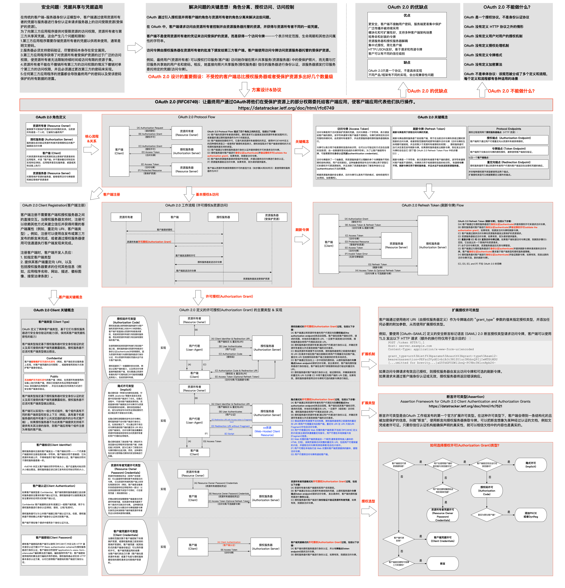

# OAuth 2.0

OAuth 2.0 是行业标准的**授权协议**。

OAuth 2.0 设计的重要假设：不受控的客户端总比授权服务器或者受保护资源多出好几个数量级

OAuth 2.0 (RFC6749)：让最终用户通过OAuth将他们在受保护资源上的部分权限委托给客户端应用，使客户端应用代表他们执行操作。

全景图如下：

## 1 安全问题：凭据共享与凭据盗用
在传统的客户端-服务器身份认证模型中，客户端通过使用资源所有者的凭据与服务器进行身份认证来请求服务器上的访问受限资源(受保护的资源)。
为了向第三方应用程序提供对受限资源的访问权限，资源所有者与第三方共享其凭据。这会产生几个问题和限制：
1. 第三方应用程序需要存储资源所有者的凭据以供将来使用，通常是明文密码。
2. 服务器必须支持密码验证，尽管密码本身存在安全漏洞。
3. 第三方应用程序获得了对资源所有者受保护资源的过于广泛的访问权限，使资源所有者无法限制持续时间或访问有限的资源子集。
4. 资源所有者不能在不撤销所有第三方的访问权限的情况下撤销对单个第三方的访问权限，并且必须通过更改第三方的密码来实现。
5. 任何第三方应用程序的泄露都会导致最终用户的密码以及受该密码保护的所有数据的泄露。

## 2 OAuth 2.0 解决问题的关键思想：角色分离、授权访问、访问控制
OAuth 通过引入授权层并将客户端的角色与资源所有者的角色分离来解决这些问题。
在 OAuth 中，客户端请求访问由资源所有者控制并由资源服务器托管的资源，并获得与资源所有者不同的一组凭据。
客户端不是使用资源所有者的凭证来访问受保护的资源，而是获得一个访问令牌——一个表示特定范围、生命周期和其他访问属性的字符串。
访问令牌由授权服务器在资源所有者的批准下颁发给第三方客户端。客户端使用访问令牌访问资源服务器托管的受保护资源。
例如，最终用户(资源所有者) 可以授权打印服务(客户端) 访问她存储在照片共享服务(资源服务器) 中的受保护照片，而无需与打印服务共享她的用户名和密码。相反，她直接向照片共享服务(授权服务器) 信任的服务器进行身份认证，该服务器颁发打印服务委托特定的凭据(访问令牌)。

## 3 OAuth 2.0 的优点
1. 更安全，客户端不接触⽤户密码，服务端更易集中保护
2. ⼴泛传播并被持续采⽤
3. 模块化和可扩展性好，⽀持多种客户端架构场景
4. 短寿命和封装的令牌
5. 资源服务器和授权服务器解耦
6. 集中式授权，简化客户端
7. HTTP/JSON友好，易于请求和传递令牌
8. 客户可以有不同的信任级别

## 4 OAuth 2.0 的缺点
1. OAuth 2.0只是一个协议，不是具体实现
2. 不同产品/框架有不同的实现，会出现兼容性问题

## 5 OAuth 2.0 不能做什么？
1. OAuth 是一个授权协议，不是身份认证协议
2. OAuth 没有定义 HTTP 协议之外的情形
3. OAuth 没有定义用户对用户的授权机制
4. OAuth 没有定义授权处理机制
5. OAuth 没有定义令牌格式
6. OAuth 没有定义加密算法
7. OAuth 不是单体协议：该规范被分成了多个定义和流程，每个定义和流程都有各种适用的场景

## 参考资料
1.  [RFC6749: The OAuth 2.0 Authorization Framework](https://datatracker.ietf.org/doc/html/rfc6749)