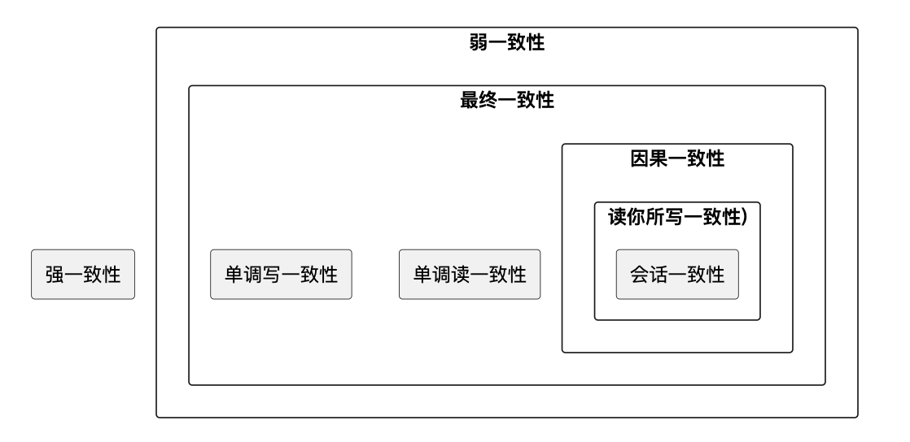
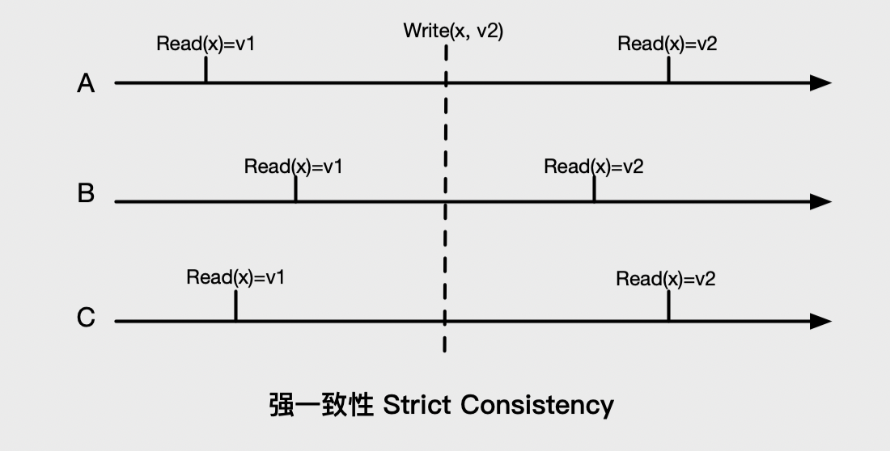
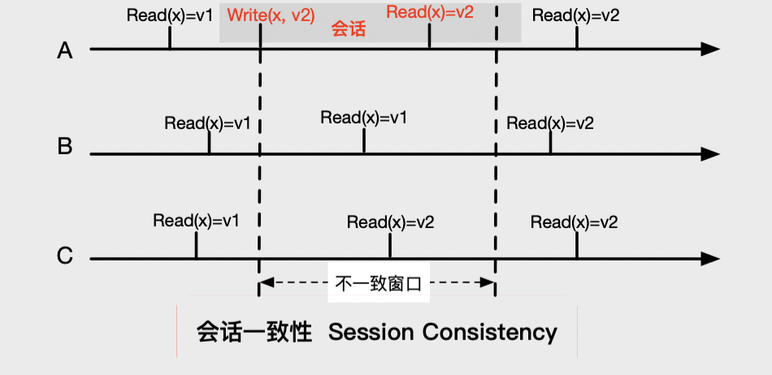
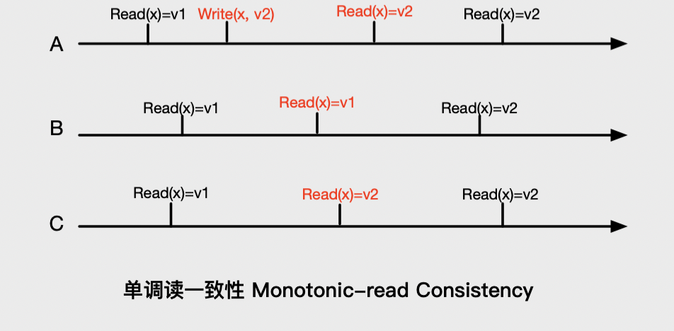

# Consistency 一致性

## 1 一致性模型分类
从严格意义上讲，理想情况下，真正的一致性模型只有一种，即我们常说的**强一致性(也被称为严格一致性)。即当对某个数据进行了一个更新操作后，所有后续的观察者都应该感知到这次数值变化并以此为基础进行后续的读/写行为**。但是真实世界的现实是：多数 NoSQL 系统都采用了弱一致性模型。这是多机分布情况下系统追求高可用和高扩展性必须做出的一种妥协。因为根据 CAP 理论可知：在有些情况下，没有系统能够同时满足一致性、可用性和分区容忍性这3组约束，而对于互联网环境下的分布式计算系统，分区容忍性(P)是一个先天设定的场景，也就是说，存储系统只能从一致性(C)或者可用性(A)中选择更看重的一个因素来构建具体系统，从而使系统要么满足 AP 要么满足 CP 约束。对于互联网应用来说，很多时候对于可用性有很高的要求，这涉及用户体验，所以这是为什么很多 NoSQL 系统采用弱一致性的理论和实现基础的原因。

一致性模型包括：
* 强一致性 Strict Consistency
* 弱一致性 Weak Consistency
* 最终一致性 Eventual Consistency
* 因果一致性 Causal Consistency
* “读你所写”一致性 Read-your-write Consistency
* 会话一致性
* 单调读一致性 Monotonic-read Consistency
* 单调写一致性 Monotonic-write Consistency

```plantuml
@startuml
rectangle 强一致性
rectangle 弱一致性 {
    rectangle 最终一致性 {
        rectangle 单调读一致性
        rectangle 单调写一致性
        rectangle 因果一致性 {
            rectangle 读你所写一致性) {
                rectangle 会话一致性
            }
        }
    }
}
@enduml
```

最终一致性是弱一致性的一种特殊情况，除了强一致性外，其他类型的一致性模型都属于最终一致性模型的特例或者其变体。会话一致性是“读你所写”一致性的变体，“读你所写”一致性是因果一致性的一个特例。

### 1.1 强一致性 Strict Consistency
对于连接到数据库的所有进程，看到的关于某数据的数据值是一致的，如果某进程对数据进行了更新，所有进程对后续读操作都会以这个更新后的值为基准，直到这个数据被其他进程改变为止。

上图是在上文设定的场景下强一致性模型的具象说明，进程 A 通过 write(x,v2) 将x的数值由v1更新为v2后，所有进程在这个操作之后都会看到x最新的取值v2。而所谓“弱一致性”，即不能满足强一致性的情形皆可统称为弱一致性。

### 1.2 最终一致性 Eventual Consistency
最终一致性是一种弱一致性。它无法保证某个数值 x 做出更新后，所有后续针对 x 的操作都能够立即看到新数值，而是需要一个时间片段，在这个时间片段之后可以保证这一点，而在这个时间片段之内，数据也许是不一致的，这个系统无法保证强一致性的时间片段被称为“不一致窗口”(Inconsistency Window)。如下图，即使是对 x 做出改变的进程 A，也有可能在不一致窗口时间片内看到旧的数值。

### 1.3 因果一致性 Causal Consistency
因果一致性发生在进程之间有因果依赖关系的情形下。如下图所示场景中，当进程 A 将 x 的数值更新为 v2 后，会通过 Notify(A,B,x,v2) 来通知进程 B 数值已经做出改变，进程 B 在接收到通知后，之后的操作会以新值作为基础进行读/写，即进程 A 和进程 B 保持了数据的因果一致性。而对进程 C 来说，在不一致窗口内可能还是会看到 x 的旧数值 v1 。

### 1.4 “读你所写”一致性 Read-your-write Consistency
“读你所写”一致性是因果一致性的特例，可以在概念上理解为：进程 A 把数据 x 更新为数值 v2 后，立即给自己发出了一条通知 Notify(A,A,x,v2)，所以进程 A 之后的操作都是以新数据 v2 作为基础。其他进程未受影响，在不一致窗口内仍旧可能看到 x 的旧数值 v1。

### 1.5 会话一致性
“读你所写”一致性的一种现实版本变体即“会话一致性”。当进程 A 通过会话与数据库系统连接，在同一个会话内，可以保证其“读你所写”一致性。而在不一致窗口内，如果因为系统故障等原因导致会话终止，那么进程 A 仍旧可能读出 x 的旧值 v2。

### 1.6 单调读一致性 Monotonic-read Consistency
单调读一致性是最终一致性的另外一种变体。它保证如果某个进程读取到数据 x 的某个版本数据 v2，那么系统所有后续的读取操作都不能看到比 v2 更老版本的数值，比如 v1。

### 1.7 单调写一致性 Monotonic-write Consistency
另外一种最终一致性的变体是“单调写一致性”，对于某个进程来说，单调写一致性可以保证其多次写操作的序列化，如果没有这种保证，对于应用开发者来说是很难进行程序开发的。

在实际的存储系统中，可以综合使用以上的一致性模型，比如可以综合“单调读一致性”模型和“会话写一致性”模型。对于实际存储系统来说，尽管同时满足以上两种一致性并非必需，但是如果系统能够具备这一点，对于使用存储系统的应用开发人员来说会大大简化其应用开发难度，与此同时，系统还可以在放松一致性要求情况下提供系统的高可用性。

## 参考资料
1. [《大数据日知录-架构与算法》](https://book.douban.com/subject/25984046/)
