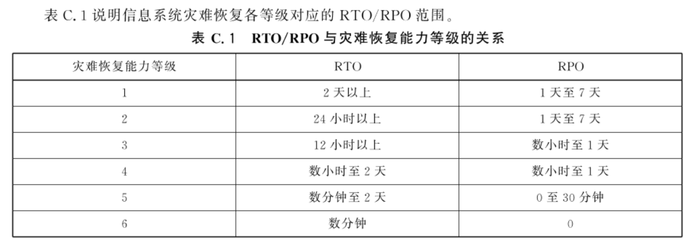

**RPO(Recovery Point Objective)** 即数据恢复点目标，主要指的是业务系统所能容忍的数据丢失量。
* RPO是反映数据丢失量的指标，体现了企业能容忍的最大数据丢失量的指标。
* RPO越小，代表企业数据丢失越少，企业损失越小。

**RTO(Recovery Time Objective)** 即恢复时间目标，主要指的是所能容忍的业务停止服务的最长时间，也就是从灾难发生到业务系统恢复服务功能所需要的最短时间周期。
* RTO是反映业务恢复及时性的指标，体现了企业所能容忍的业务系统最长恢复时间。
* RTO值越小，代表容灾系统的恢复能力越强，但企业投资也越高。

### RTO/RPO的示意图

### RTO/RPO与灾难恢复能力等级的关系

## 参考资料
1. [什么是RPO和RTO？](https://support.huaweicloud.com/sdrs_faq/sdrs_06_0440.html)
2. [GB/T 20988-2007 信息安全技术 信息系统灾难恢复规范](https://openstd.samr.gov.cn/bzgk/gb/newGbInfo?hcno=B7DDC387ECA63A1C1CEAE15BE01E2A61)