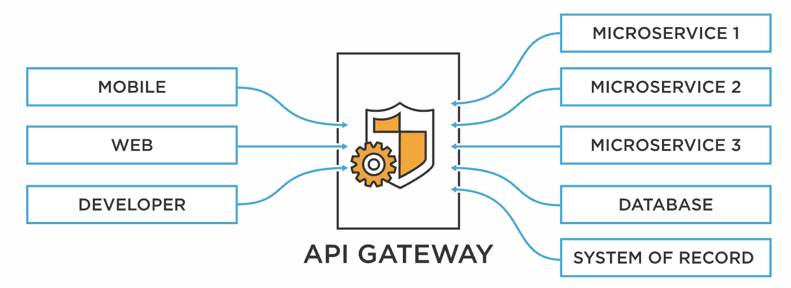

# API管理与API网关

## 1 API管理
### 1.1 为什么需要API？
* 在API出现之前，数据的传输和交换并没有标准的方式，大多数情况下是通过数据库、Excel表格、文本，或者是FTP，不同的系统和程序通过各种五花八门的方式来沟通。这些混乱的背后，隐藏了巨大的开发成本和安全隐患：权限控制、数据精细管控、限流限速、审计等，都只能用笨重的方式来解决。这就是计算机世界中的“巴别塔(Tower of Babel)”，因此只有解决了不同语言开发的系统以及不同存储方案带来的问题，才有机会构建足够复杂的产品。
* 而API的出现，则成功地解决了巴别塔问题，开发者只需要关心其他系统对外暴露的API即可，无需关心底层实现和细节。我们熟知的手机App、网络游戏、视频直播、远程会议和IoT设备，都离不开终端设备与服务端的连接和数据传输，这些都是通过API完成的。

API是各个不同的应用程序和系统之间互相调用和传输数据的标准方式。在很多的开发团队中都是使用API-first的模式，围绕着API来进行产品的迭代，包括测试、Mock、文档、API网关、Dev Portal等，这就是API全生命周期管理(Full Life Cycle API Management)。

### 1.2 为什么需要管理API？
API的功能究竟是什么？
* 它们公开组织的数据并通过应用程序提供其资产。
* API还用于向客户、员工和合作伙伴交互添加数字层。

**这就是API管理如此重要的原因。它为开发人员和企业提供了用于保护、扩展、管理、分析和货币化API程序的工具**。
一项详细研究API采用在数字化转型计划中的作用的研究表明，API是关键推动因素。

**API管理的七大好处**：
1. **改善客户体验**：API推动新应用程序的快速发展，并在各种渠道中创造无缝体验，满足客户的需求。由于连接性的提高，不同行业的组织可以在全新的水平上提供响应性和便利性。例如，API带来了你必须自己构建的个性化和增值服务。
2. **可扩展性**：企业正在处理比以往更多的应用程序和数据。他们需要不断扩大规模，同时培养创新文化——通常是通过创建和发布新的API。通过在整个API生命周期中简化访问并减少技术负担，API管理支持可扩展性。
3. **更严格的安全性**：当多方(从内部开发人员到合作组织和客户)都可以访问API时，安全性成为关键焦点。当你的应用程序是分布式和断开连接时，管理数据访问可能会很棘手。你需要采取一切可能的措施来保护敏感数据，并确保正确分配和管理权限。如果没有API管理解决方案，很难实现这一目标，因为你无法利用其可见性和一致性。
4. **避免关键系统的变化**：API管理解决方案可以利用现有系统，并允许你避免对公司每天使用的关键系统进行任何更改。
5. **变得更加敏捷和响应迅速**：能够实时快速创建和发布任何端点有助于企业保持敏捷并变得更具适应性。
6. **数据驱动的决策**：API管理解决方案收集和分析数据，让你深入了解使用模式、设备和地理位置 -- 所有这些都旨在推动更明智的决策。
7. **最大化开发人员性能**：开发人员可以使用集中式生命周期管理解决方案来了解和分析整套API和Web服务。他们在一个集中的面板中获得出色的服务可见性和可追溯性，从而提高团队的工作效率。由于专用的开发人员门户，开发人员还可以享受更轻松和自动化的文档管理。借助Sandbox等模块，API管理工具还支持与外部开发团队进行测试。

### 1.3 什么是API管理？
API管理是指企业内及多云环境中API连接的创建、发布和管理流程，包括为组织开发、设计、监控、测试、保护和分析API的过程。
* API管理并不仅仅是提供一个存放这些API连接的场所，而是提供一个可扩展的统一平台，以支持企业共享并社交化其API配置，同时控制访问权，收集和分析使用情况统计数据，并实施关联的安全策略。
* 通过API管理，组织可以使其公共API和私有API供用户使用并且可以扩缩。

事实上，API管理平台用于管理企业的整个API生态系统，从头到尾管理API生命周期。

### 1.4 如何进行API管理？
通过API管理解决方案使API创建、部署、发布和维护更容易和更精简。功能全面的API管理平台通常包含以下工具：
* 开发者门户：一个网站，开发者可以在其中查找在其客户端应用中使用API所需的信息和凭据。开发者门户可以为开发者提供交互式文档、面向开发者的分析、创收信息、应用审批状态以及其他工具和服务。
* 设计和开发：一种开发者体验和一组工具，用于设计和构建API产品以及使现有系统能够使用API。
* 测试：允许进行各种测试，从API的模拟测试到功能测试、性能测试和安全测试。
* **API网关**：API网关在运行时执行API调用的中介操作和强制操作。
* 分析和监控：运营指标(如一段时间内的使用情况) 可让开发者提高API部署的速度和可靠性。借助创收和业务指标(例如通过特定API带来的收入)，组织可以衡量其API生态系统的业务健康状况。  
* 政策管理：政策定义了API的操作，包括数据的缓存频率、协议转换方式及其使用配额。管理这些政策是维护API的重要方面。
* 安全和治理：API在授权、身份验证、防止滥用以及将身份与客户端和开发者凭据相关联方面需要采用一致的标准。

### 1.5 如何衡量API管理工作的成功与否？
考虑以下5个API的关键目标：
1. 可靠性。可靠性是指API对开发人员是否方便可用。
   * 停机时间是衡量可靠性的有用指标。API是否随时可用？
   * 另一个指标是配额，它定义了开发人员在特定时间范围内可以调用多少次API。配额可以保护API不被滥用，使管理更具可预测性。有些API提供商都是根据配额来制定业务模式和定价。
2. 灵活性。灵活性是指开发人员在采用API时是否拥有多种选项。API的灵活性更大，则企业管理API需要投入的精力(和成本)更多。
3. 质量。质量是指API行为是否符合开发人员的期望。这是一种衡量开发人员对API满意度的方法。
4. 速度。速度可以通过访问延迟和吞吐量来衡量。限流或缓存等技术都可能会影响速度。
5. 成本。衡量成本的目的是为开发人员提供最具性价比的支持。所有其他4个目标都多少有助于实现成本目标。

## 2 API网关
### 2.1 什么是API网关？
在计算机网络中，网关(Gateway) 是转发其他服务器通信数据的服务器，接收从客户端发送来的请求时，它就像自己拥有资源的源服务器一样对请求进行处理。有时客户端可能都不会察觉，自己的通信目标是一个网关。网关也经常指把一种协议转成另一种协议的设备，比如语音网关。

API网关是API管理解决方案/管理平台中最重要的部分，并充当已连接系统和服务的网关。 
* API网关用于接受所有应用编程接口(API)调用、整合处理这些调用所需的各种服务，并返回相应的结果；即处理客户及其连接的第三方服务之间的所有路由请求、组合和协议转换。
* API网关可通过部署关键的安全认证和实施协议，确保API连接的安全性，其中包括传输层安全性(TLS)加密和OAuth(开放式授权)技术标准。
* API网关还允许开发人员轻松将微服务用作托管API。

### 2.2 为什么需要API网关？
大多数企业API都是通过API网关部署的。API网关通常会处理跨API服务系统使用的常见任务，例如用户身份验证、速率限制和统计信息。
API 服务最基本的作用是接受远程请求并返回响应。但是，现实却并非如此简单。不妨想一下你在托管大型API时经历的种种顾虑：
* 你**希望保护API免受过度使用和滥用**，因此选择了身份验证服务和速率限制。
* 你**想了解人们如何使用你的API**，因此添加了分析和监控工具。
* 如果你**已有货币化API**，则还要连接到计费系统。
* 你可能**采用了微服务架构**，因此，单个请求可能需要调用数十个不同的应用。
* 随着时间推移，你会添加一些新的API服务并淘汰另外一些服务，但你的客户仍希望原样获得所有服务。

面对这些复杂局面，你的挑战是为客户提供简单而可靠的体验。**API网关是一种将客户端接口与后端实现分离的方式**。当客户端发出请求时，API网关会将其分解为多个请求，然后将它们路由到正确的位置，生成响应，并跟踪所有内容。

### 2.3 API网关有哪些功能？
API网关的**主要职责**是API路由、API组合和协议转换。
* **请求路由**：API网关的关键功能之一就是请求路由。API网关通过将请求路由到相应的服务来实现一些API操作。当它接收到请求时，API网关会查询路由映射，该映射指定将请求路由到哪个服务。例如，路由映射可以将HTTP方法和路径映射到服务的HTTP URL。此功能与Nginx等Web服务器提供的反向代理功能相同。
* **API组合**：API网关通常不仅仅是简单地扮演反向代理的角色。它也可能使用API组合实现一些API操作。
* **协议转换**：API网关也可以完成协议转换。它可能为外部客户端提供RESTful API，即使应用程序服务在内部使用混合协议，包括REST和gRPC。在需要时，某些API的操作实现在RESTful外部API和基于内部的gRPC API之间进行转换。

API网关**可以为每一个客户端提供它们专用的API**。
1. **API网关可以提供单一的万能(one-size-fits-all, OSFA) API**。
   * 单一API的问题在于不同的客户端通常具有不同的需求。例如，第三方应用程序可能需要Get Order Details API操作以返回完整的Order信息；而移动客户端只需要订单的部分数据即可。
   * 解决此问题的一种方法是为客户端提供在请求中指定服务器应返回哪些字段和相关对象的选项。
   * 这种方法适用于公共API，因为这些API必须为大量的第三方应用程序提供服务，但它通常不会为客户端提供所需的细粒度控制。
2. 更好的方法是，**API网关为每个客户端提供自己的API**。
   * 例如，API网关可以为XX移动客户端提供专门为满足其要求而设计的API。它甚至可以为Android和iOS移动应用程序提供不同的API。
3. **API网关可以为第三方开发人员实现公共API**。

API网关**除了提供上面几个主要功能之外，也可以实现所谓的边缘功能。边缘功能(Edge Function)，顾名思义，是在应用程序边缘实现的请求、处理功能**。

应用程序可能实现的边缘功能包括：
* **身份验证**：验证发出请求的客户端身份。
* **访问授权**：验证客户端是否有权执行该特定操作。
* **速率限制**：限制特定客户或所有客户端每秒的请求数。
* **缓存**：缓存响应以减少对服务的请求数。
* **指标收集**：收集有关API使用情况的指标，以进行计费分析。
* **请求日志**：记录请求历史。

**应用程序中有三个不同的位置可以实现这些边缘功能**：
1. 首先，你可以在后端服务中实现它们；
2. 第二种选择是在API网关上游的边缘服务中实现这些边缘功能。
   * 边缘服务是外部客户端的第一个联系点。它在将请求传递给API网关之前对请求进行身份验证并完成其他边缘处理。
   * 使用专用边缘服务的一个重要好处是它可以分隔问题。API网关侧重于API路由和组合。
   * 使用专用边缘服务的另一个好处是它集中了关键边缘功能的职责，例如身份验证。当应用程序具有多种语言和框架编写的API网关时，这一点变得尤为重要。弊端就是由于额外的请求跳跃而增加了网络延迟，它还在增加了应用程序的复杂性。
3. 第三个选项，就是在API网关中实现这些边缘功能(尤其是访问授权)。

### 2.4 API网关的好处和弊端
**好处**：
* 其中一个主要好处是它**封装了应用程序的内部结构**。客户端不必调用特定服务，而是与API网关通信。
* API网关为每个客户端提供特定于客户端的API，从而**减少客户端和应用程序之间的往返次数**。
* 它还**简化了客户端代码**。

**弊端**：
* **它是另一个必须开发、部署和管理的高可用组件，但存在成为开发瓶颈的风险**。
* 开发人员必须更新API网关才能对外公开服务的API。更新API网关的过程尽可能轻量化是非常重要的。否则，开发人员将被迫排队等待更新API网关。

### 2.5 API网关的设计难题
设计API网关时，需要考虑以下几个问题：
* 性能和可扩展性。
* 使用响应式编程抽象编写可维护的代码。
* 处理局部故障。

#### 2.5.1 性能和可扩展性
**API网关是应用程序的入口。所有外部请求必须首先通过API网关。所以，API网关的性能和可扩展性是非常重要的**。

**影响API网关的性能和可扩展性的关键设计决策是：API网关应该使用同步还是异步I/O**。
* 在同步I/O模型中，每个网络连接由专用线程处理。
  * 这是一个简单的编程模型，并且工作得相当好。
  * 然而，同步I/O的一个限制是操作系统线程是重量级的，因此**API网关可以拥有的线程数量和并发连接数存在上限**。
* 另一种方法是使用异步(非阻塞)I/O模型。
  * 在此模型中，单个事件循环线程将I/O请求分派给事件处理程序。可以选择各种异步I/O技术。
  * 非阻塞I/O更具可扩展性，因为它没有使用多个线程的开销。
  * 但**弊端**是它比基于异步回调的编程模型要复杂很多，代码更难编写、理解和调试。事件处理程序必须快速返回以避免阻塞事件循环线程。
* 此外，**使用非阻塞I/O是否具有有意义的整体优势取决于API网关的请求处理逻辑特性**。
  * Netflix使用NIO重写其边缘服务器Zuul的结果喜忧参半：
    * 一方面，使用NIO降低了每个网络连接的成本，因为每个网络都不再有专用线程；
    * 在运行I/O密集型逻辑的Zuul集群(例如请求路由)的吞吐量增加了25%，CPU利用率降低了25%；
    * 在运行CPU密集型逻辑的Zuul集群(如解密和压缩)没有显示出任何改进。

#### 2.5.2 处理局部故障
除了可扩展之外，API网关也必须可靠。

提高可靠性的方法：
1. 实现可靠性的一种方法是：在**负载均衡**器后面运行多个API网关实例。如果一个实例失败，负载均衡器会将请求路由到其他实例。
2. 还有一种方法可以提高API网关可靠性：**API网关需要正确处理可能导致高延迟的请求**。
    * 当API网关调用服务时，服务总是很慢或不可用。
    * API网关可能会在很长一段时间内(可能无限期地)等待响应，这会消耗资源并阻塞向客户端发送的响应。
    * 对失败服务未完成的请求甚至可能消耗宝贵的资源(例如线程)，并最终导致API网关无法处理任何其他请求。
    * 解决方案是，**API网关在调用服务时使用断路器模式**。

## 3 微服务模式：API Gateway / Backends for Frontends
### 3.1 背景
假设我们正在利用微服务模式构建一套在线商店，并要包含产品细节页面，需要为产品信息用户界面开发出多个版本：
* 基于HTML5/JavaScript的用户界面，用于桌面与移动浏览器 -- HTML由服务器端Web应用生成。
* 原生Android与iPhone客户端——这些客户端通过REST API与服务器进行交互。

另外，在线商店必须通过REST API发布产品细节，以供第三方应用程序使用。

产品细节UI可以显示出大量产品信息。举例来说，Amazon.com的 POJOs in Action 图书详情页面中会显示：
* 此书的基本信息，如标题、作者、价格等
* 书籍的购买记录
* 库存
* 购买选项
* 经常与此书籍搭配购买的货品
* 买过此书的买家经常购买的其它货品
* 客户评论
* 卖家排名
* ......

在使用微服务模式的在线商店中，产品详情数据会分布在多项服务之间，例如：
* 产品信息服务—产品的基本信息，如标题与作者等
* 价格服务—产品价格
* 订单服务—产品的购买历史
* 库存服务—当前产品的可购买数量
* 评论服务—客户评论
* ......
 
因此，显示产品详情的代码需要从这些服务中获取信息。

### 3.2 问题
微服务架构的应用客户端如何访问各项服务？

### 3.3 需求/关注点
* 微服务提供的API粒度通常与客户端需要的有所不同。微服务通常提供的是细粒度API，这意味着客户端需要同多项服务进行交互。举例来说，如之前所提到的，客户端需要从多项服务处获取数据方可获得产品详情。
* 不同客户端需要不同的数据。举例来说，有产品详情页面的桌面浏览器版本通常较移动版复杂。
* 不同客户端的网络性能亦有所区别。举例来说，移动网络通常较非移动网络速度更慢且更延迟。当然，广域网速度也必然低于局域网。这意味着原生移动客户端所使用的网络在性能上与服务器端Web应用采用的局域网完全不同。服务器端Web应用能够向后端服务发送多条请求，而且不会影响到用户体验，但移动客户端则只能发送少量请求。
* 服务实例数量与其位置（主机与端口）会发生动态变化。
* 服务的划分方式会随时间的推移而改变，且不应被客户端所感知。

### 3.4 解决方案：API网关所有者模式
使用API网关作为全部客户端的单一入口点。该API网关通过以下两种方式之一处理请求。部分请求会被直接代理/路由至对应的服务，另一部分请求则需要接入多项服务。

相比提供满足所有需求的API，API网关可以针对不同客户端提供出不同的API。举例来说，Netflix API网关运行的是客户端特定适配代码，这种代码能够为各客户端提供最符合其需求的API。

API网关还能够实现安全防护，例如验证当前客户端是否有权执行该请求。

### 3.5 API网关模式变种：Backends for Frontends(后端前置模式)
此模式的一个变体是前端模式的后端。它为每种客户端定义了一个单独的API网关。

在此示例中，存在三种客户端：Web应用程序、移动应用程序和外部第三方应用程序。共有三种不同的API网关。每一个都为其客户端提供一个API。

## 4 API网关技术对比
### 4.1 Nginx

### 4.2 Zuul

### 4.3 Kong

### 4.4 Traefik

### 4.5 总结：能力对比

## 5 你的软件系统是否真的需要一个API网关？
从前面总结的来看，API管理和API网关肯定是有场景和优势的。
从系统演进的观点来看，一个简单系统逐渐演进到一个复杂点的系统时，在某个阶段，肯定是需要API网关的。

**但当前你的软件系统是否需要一个API网关呢**？我觉得还是看几个关键点：
1. **是否有API管理的场景需求**？比如提供了多少API、有多少类型客户端使用你的API、有多少外部第三方应用使用你的API。
2. **是否是直接基于公有云构建的在线系统**？如果是基于公有云，可以考虑下上面的问题1，以及成本
3. **如果是基于私有云，基础设施都需要自建的话，是否有资源支撑一个API网关，保证其性能和可靠性**？比如，如果是单节点居多的场景，何必呢？
4. **如果是基于私有云，基础设施都需要自建的话，团队成员是否有能力维护一个API网关，保证其性能和可靠性**？毕竟，从上面的总结可以看到，引入API网关，就是给系统找了一个瓶颈的预备队员。

如果这些答案都是「否」的话，我觉得可能就不适合引入API网关了。
如果希望做复用，可以考虑把API管理的能力，比如身份验证、访问授权、缓存、指标和日志等封装在统一的SDK；各服务基于SDK实现服务的API，这样也可以屏蔽一部分API边缘功能的实现细节。实际上也多不了多少开发工作，却简化了系统维护，以及规避了引入API网关后的系统运行风险。

## 参考资料
1. [什么是API管理？，IBM](https://www.ibm.com/cn-zh/topics/api-management)
2. [什么是API管理？，Google Cloud](https://cloud.google.com/learn/what-is-api-management?hl=zh-cn)
3. [什么是API管理？，RedHat](https://www.redhat.com/zh/topics/api/what-is-api-management)
4. [【API管理】什么是API管理，为什么它很重要？，腾讯云](https://cloud.tencent.com/developer/article/1972706)
5. [网关，wikipedia](https://zh.wikipedia.org/zh-cn/%E7%BD%91%E5%85%B3)
6. [云原生时代，API网关为何如此重要？，CSDN](https://blog.csdn.net/csdnnews/article/details/127382842)
7. [什么是API网关？，Tibco](https://www.tibco.com/zh-hans/reference-center/what-is-an-api-gateway)
8. [API网关能做什么？，RedHat](https://www.redhat.com/zh/topics/api/what-does-an-api-gateway-do)
9. [Pattern: API Gateway / Backends for Frontends，microservices.io](https://microservices.io/patterns/apigateway.html)
10. [面试前你需要了解的16个系统设计知识](https://mp.weixin.qq.com/s/-Lk0bP28KT2Cc1RuvEBuAQ)
11. [《微服务架构设计模式》](https://book.douban.com/subject/33425123/)