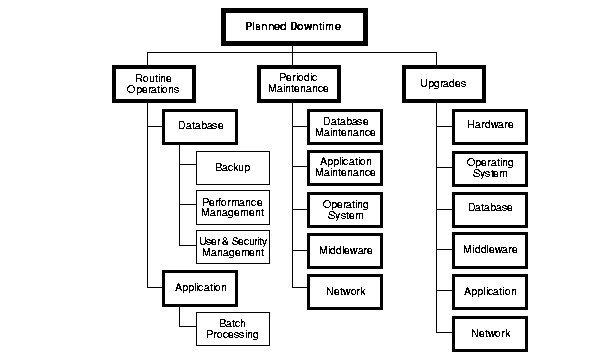

概念就那么些，花点时间整理一下，不搞清楚，多少年还是搞不清楚。

最近需要处理一些系统稳定性问题，所以整理记录一下。

「Availability」，相关翻译「可用性」。要注意跟「Usability」的区别，这个也经常翻译成「可用性」，今天我们讨论的不是这个「Usability」。

直观地讲，「Availability」可用性就是系统能不能正常工作的一种属性。可用性跟 [容错性](./fault-tolerance.md) 有些区别。

下面分别整理了几个领域关于可用性的定义。实际上我们日常说的每个概念，都是自带上下文的，这是容易忽视的。然后分析了导致软件系统不可用的因素以及各种场景下的可用性适合的度量方法。

## 1 不同领域的「Availability」 
### 1.1 信息安全里的「Availability」
很久以前参加过一些信息安全的培训。

最开始了解到的，就是信息安全三要素CIA，即：

* 「Confidentiality」保密性：保障数据不被未授权的用户访问或泄露。
* 「Integrity」完整性：保障数据不被未授权地篡改。
* 「Availability」可用性：保障已授权用户合法访问数据的权利。

信息安全三要素 CIA 是安全系统的基本属性。

数据安全的可用性，举个例子，系统被DDos攻击了，导致系统卡顿不提供服务，这个DDos就是在破坏可用性。

### 1.2 CAP定理中的「Availability」

「CAP」是「Consistency/Availability/Partition tolerance」的简称：

* 「Consistency」一致性(强一致性)：在分布式系统中的同一数据多副本场景下，对于数据的更新操作体现出的效果与只有单份数据是一样的。换句话说，就是在所有节点访问的都是最新的数据副本。
* 「Availability」可用性：客户端在任何时刻对大规模数据系统的读/写操作都应该保证在限定延时内完成。换句话说，就是每次请求都能及时获得正确的响应，但不保证获得的数据是最新数据。
* 「Partition tolerance」分区容忍性：在大规模分布式数据系统中，网络分区现象，即分区间的机器无法进行网络通信的情况是必然会发生的，所以系统应该能够在这种情况下仍然继续工作。

CAP 最初由 Eric Brewer 于1999年提出。他同时证明了对于一个大规模分布式数据系统来说，CAP三要素不可兼得，同一个系统最多只能实现其中两个，而必须放宽第三个要素来保证其他两个要素被满足。

枚举出来就是要么AP，要么CP、要么AC，但是不存在CAP。

当然，在 2012 年 Eric Brewer (还是他) 在发表的「Eric Brewer.CAP Twelve Years Later: How the “Rules” Have Change. IEEE Computer Society.2012」中指出：实践过程中应用 CAP 理论时，不得不在三要素中选择两个而牺牲另外一个的做法具有误导性。具体内容以后再分享。总之，就是能够把对整个系统的概念范围拆小来考虑，在没发生网络分区的场景下，保证AC，实现整个系统的CAP；在发生网络分区时，进行状态管理，在网络分区解决之后，恢复数据一致性，让系统最终进入CAP状态。

「一致性」又有了不同的概念细分，比如弱一致性、最终一致性、单调写一致性等等。一致性的内容见 [《Consistency 一致性》](../distributed-systems/consistency.md)

其实这里讲的是，分布式数据系统的可用性「Availability」，即每次请求都能及时获得正确的响应。
我们一般在做系统设计的时候讲的可用性，大致就是这一类。

### 1.3 软件质量模型中的「Availability」

在计算机软件领域，ISO/IEC 25010 中定义的产品质量模型中，定义了八个质量属性：功能适用性(Function Suitability)、性能效率(Performance Efficiency)、兼容性(Compatibility)、可用性(Usability，其实我感觉翻译成「易用性」更容易避免歧义)、可靠性(Reliability)、安全(Security)、可维护性(Maintainability)、可移植性(Portability)。

其中「Availability」可用性属于可靠性(Reliability)属性的一个子属性。定义为：系统、产品或组件在需要使用时，可操作和可访问的程度。经常听到的「高可用」就是「high availability」、「HA」。「high availability」高可用，指系统能够比正常时间更久地保持一定的运行水平。能够正常访问时间越久，可用性就越高。

在定义质量目标的时候，说的是「软件质量模型」里面的。

### 1.4 AWS 定义的(云服务)「Availability」

关于「Availability」可用性，AWS的定义是：工作负载可供使用的时间百分比。可供使用(Available for use)指的是在有需要时履行其约定的功能。

这是 AWS 定义它提供的服务能力。

AWS 还定义了一个计算公式用来衡量服务可用性。

这个用一段时间内 (通常是一年) 正常运行时间的百分比来衡量可用性。

其中「Total Time」就是用来评估可用性的总的时间，「Available for Use Time」是这个评估范围内能够正常运行的时间。

AWS还特别提到，有些厂商选择把计划的维护停机时间排除在「Total Time」之外，AWS觉得这么算不合适，因为在计划维护的时间内，这些厂商的客户实际上也可能是需要使用这些服务的。

通过 AWS 的这个定义，可以得到一个可用性指标对应的不可用时间。同时它还给出了相关的可用性对应的应用程序类别：

| **可用性** | **最大不可用时间** | **应用程序类别**                 |
| ---------- | ------------------ | -------------------------------- |
| 99%        | 3天15小时          | 批处理、数据提取、传输和负载作业 |
| 99.9%      | 8小时45分钟        | 内部工具，如知识管理、项目跟踪   |
| 99.95%     | 4小时22分钟        | 网上商务、销售点                 |
| 99.99%     | 52分钟             | 视频传输、广播工作负载           |
| 99.999%    | 5分钟              | ATM交易、电信工作负载            |

各厂商的云服务，都会采用这种百分比来描述服务的可用性，比如AWS EC2的可用性是99.99%。这些云服务能做到这么高的可用性，不是一个单点系统的设计和研发所能达到的。它可能涉及基础架构、设计、研发、运维等各方面，以及时间的沉淀。

这样看来，如果我们说「设计了一个具有 99.99% 可用性的系统」，这种描述应该是不准确的。

## 2 软件系统的可用性「Availability」
上面整理了在信息安全、软件质量模型、分布式系统、云服务等关于「Availability」可用性的定义。

总的来说，**软件系统的可用性「Availability」，在我看来，就是系统能正常使用的程度，即收到的请求能够正常响应的程度。只是在不同领域，有的通过时间来评估，有的通过结果来评估。**

### 2.1 什么会导致了低可用性(不可用)？
通常有这些原因导致之前运行正常的系统，慢慢变得不可用了：
1. **资源不足(资源耗尽)**：访问用户数量的增加(或者黑客攻击)会导致系统使用的数据量增加，从而可能导致系统资源耗尽，服务处理不过来、运行越来越慢并最终无法响应。
   * 网络带宽不足
   * 计算资源不足
   * 内存资源不足
   * 存储空间不足
   * 磁盘IO不足
   * 处理进程/线程不足
2. **外部依赖问题**：应用程序依赖的外部资源，如基础设施或者第三方依赖服务，这些资源问题越多，导致的可用性问题就会越多。
   * 如果应用程序构建在一个单一的机房，当机房网络故障(网络交换机失效)、断电等、或者自然灾害导致机房损坏，都有可能导致系统可用性问题；
   * 应用程序的服务器宕机、硬盘损坏、网卡损坏，都可能会导致系统可用性问题
   * 如果应用程序构建在某个公有云的某个可用区，当这些云服务故障(也许概率很小)，可能会导致系统可用性问题；
   * 如果应用程序依赖第三方认证系统，当第三方认证系统性能不足或者不可用，会导致当前系统无法进行认证，从而导致系统可用性问题；
   * 如果应用程序依赖第三方数据库/存储，当第三方数据库/存储性能不足或者不可用，会导致应用程序数据无法正常存取，从而导致系统可用性问题；
   * CDN服务挂掉
   * DNS被劫持
   * ...
3. **系统变更(流动行为的增加)**：如新功能发布、新版本发布导致的系统升级和数据升级。当应用程序高速发展时，通常需要更多的开发人员、设计师、测试人员和其他人来开发并维护它。大量的个体共同协作会产生大量的流动行为，包括新功能、变更功能，或者只是一般的维护工作。开发和维护应用程序的人员越多，就会产生越多的流动行为，从而增加了相互之间产生负面作用的可能。
   * 如，误操作导致脏数据或者误删除，导致数据丢失/不可用
4. **技术债务**：随着应用程序复杂性的增加，通常会导致技术债务(例如，随着应用程序逐渐发展和成熟，对软件未实现的修改和未修复的bug也会逐渐积累)。技术债务会增加可用性问题出现的可能。
   * 服务Bug
   * 系统宕机、系统故障
   * 内存溢出
5. **预期之外的系统压力变化**：随着应用程序被越来越多的人使用，超出了之前系统设计的目标。比如之前的系统设计目标(或者说实际设计能支持的能力)在一万用户访问范围的能力，当应对百万用户访问就可能会产生系统可用性问题。**可能需要对架构、代码和应用程序进行修改以支撑不断增加的压力**。这些改动通常都是在最后一刻被草草实现，缺乏足够的考虑或计划，因此也增加了问题出现的可能性。

#### 2.1.1 业界总结的服务不可用的因素
在业界中，会把服务不可用的因素分成两种：一种是有计划的，一种是无计划的。前面列出来的这些基本上属于“无计划的”。

**无计划的**：
* 系统级的故障 –  包括主机、操作系统、中间件、数据库、网络、电源以及外围设备
* 数据和中介的故障 – 包括人员误操作、硬盘故障、数据乱了
* 还有：自然灾害、人为破坏、以及供电问题。

**有计划的**：
* 日常任务：备份，容量规划，用户和安全管理，后台批处理应用
* 运维相关：数据库维护、应用维护、中间件维护、操作系统维护、网络维护
* 升级相关：数据库、应用、中间件、操作系统、网络、包括硬件升级

#### 2.1.2 总结影响服务不可用的场景和因素
**总结一下，从服务的整个生命周期来看，影响服务不可用的因素**：
1. **计划内的(符合预期的不可用)**：
   * 常规维护操作：备份、容量规划、用户和安全管理、后台批处理应用(降低性能)
   * 周期性运维：数据库维护、应用维护、中间件维护、操作系统维护、网络维护
   * 升级：数据库、应用、中间件、操作系统、网络、包括硬件升级
2. **计划外的(不符合预期的不可用)**：
   * **性能场景(性能问题会导致故障表现)**：
     * 资源不足(资源耗尽)导致的性能问题
       * 系统层面：CPU、内存、磁盘IO、存储空间、网络IO的资源不足
       * 应用层面：处理线程/进程/处理队列不足
     * (设计目标)预期之外的系统压力变化
   * **故障场景**：
     * 人工误操作
     * 外部依赖故障问题
       * 网络问题
       * 服务集群内部的硬件问题
       * 服务依赖的第三方服务故障(或者第三方服务性能不足)
     * 技术债：
       * Bug
         * 服务不响应(某些场景触发bug，导致业务逻辑处理故障、服务卡死)
         * 服务不可靠(给出错误结果导致整体业务受影响)
       * 不合适的方案
       * 工程管理问题

#### 2.1.3 业界的故障分级
亚马逊一般将故障分为4级：
* 1级是全站不可用
* 2级是某功能不可用，且无替代方案
* 3级是某功能不可用，但有替代方案
* 4级是非功能性故障，或者用户不关心的故障

阿里的可用性考核，把故障分为4级：
* 事故级：严重故障，网站整体不可用。权重100。
* A类：网站访问不顺畅或核心功能不可用。权重20。
* B类：非核心功能不可用，或核心功能只有少数客户不可用。权重5。
* C类：其他故障。权重1。

### 2.2 系统不可用的影响
可用性问题会增加经营成本，增加用户的成本，降低用户的信任度和忠诚度。
系统不可用导致业务中断、或者数据丢失，对企业会造成经济损失。

### 2.3 如何度量可用性？
通过一个客观的指标来体现一个待优化的系统属性，通过设立这样一个目标，我们可以客观地评价目前的系统表现以及跟踪一段时间内的改进和进步。对于服务风险而言，将所有的潜在因素缩减为一个单一的性能指标，可不是一件能够立刻解决的事情。服务故障可能会有很多潜在的影响，包括用户的不满、伤害，或丧失信任；直接或间接的收入损失；品牌以及口碑上的影响；不良的新闻报道等。很明显，这些因素中的一部分很难被合理地度量。为了使这个问题在我们运行的各种类型的系统中易于处理，并且保持一致，我们选择主要关注**计划外停机**这个指标。

#### 2.3.1 基于时间度量
##### 2.3.1.1 基于系统正常运行时间的比率评估
对于大多数服务而言，最直接的能够代表风险承受能力的指标就是对于计划外停机时间的可接受水平。计划外停机时间是由服务预期的可用性水平所体现的，通常我们愿意用提供的“9”系列的数字来体现，比如可用性为99.9%、99.99%或99.999%。每个额外的“9”都对应一个向100%可用性的数量级上的提高。

对于服务系统而言，这个指标通常是基于系统正常运行时间比例的计算得出的：
> 可用性 = 系统正常运行时间 / (系统正常运行时间 + 停机时间)

使用这个公式，我们可以计算出一年内可接受的停机时间，从而可以使可用性达到预期目标。例如，一个可用性目标为99.99%的系统最多在一年中停机52.56分钟，就可以达到预计的可用性目标。

##### 2.3.1.2 从MTTF、MTTR、MTBF评估
业界一般使用 MTTF、MTTR、MTBF 这3个指标来计算系统可用性：
* MTTF：全称 Mean Time To Failure，即平均无故障时间。
* MTTR：全称 Mean Time To Repair，即平均修复时间。
* MTBF：全称 Mean Time Between Failure，即平均故障间隔时间。

各时间段说明：
* t1时间段，出现问题到发现问题
* t2时间段，分析、诊断问题
* t3时间段，修复问题(修改、验证、上线)
* t4时间段，系统正常运行

定义 n 表示故障数。上图发生了两次故障，n=2
> MTTF = (∑t4) / n
> MTTR = (∑(t1+t1+t3))/ n
> MTBF = MTTF + MTTR
> 
> 可用性 = MTTF / MTBF * 100%

但是，并不是“可用性”的值越高，系统可用性就越高，举个例子：
* A系统，MTBF=2h，MTTR=5s，即可以稳定运行2小时，然后挂掉，5秒钟之后又恢复了，通过公式计算Availability=0.9999768，约等于5个9。
* B系统，MTBF=30day，MTTR=1h，即可以稳定运行30天，然后挂掉，1小时之后恢复，通过公式计算Availability=0.9986130，约等于4个9。

虽然A系统计算出来的可用性高于B系统，但是A系统发生故障的频率远远高于B系统（即A系统的MTTF远远低于B系统），用户体验非常差，故可用性除了要关注 Availability 的值，还需要关注 MTTF。

故系统可用性评价标准：
* MTTF：越大越好
* 可用性：越高越好

##### 2.3.1.3 从RTO、RPO评估
**RPO(Recovery Point Objective)** 即数据恢复点目标，主要指的是业务系统所能容忍的数据丢失量。
**RTO(Recovery Time Objective)** 即恢复时间目标，主要指的是所能容忍的业务停止服务的最长时间，也就是从灾难发生到业务系统恢复服务功能所需要的最短时间周期。

详见 [RPO & RTO](../others/RPO-RTO.md) 。

#### 2.3.2 基于请求成功率度量
在Google，基于时间的可用性通常毫无意义。因为Google需要着眼全球范围内的分布式服务。Google所采用的故障隔离手段能够保证在任何时候、任何地方对于一个给定的服务，总是可以处理一定的用户流量(也就是说，随时都可以是部分“在线”的)。

因此，Google通过**请求成功率**来定义服务可用性。
> 可用性 = 成功请求数 / 总的请求数

上面这个公式，体现了这个基于产量的指标是怎样通过滚动窗口计算出来的(比如，一天内成功请求的比率)。例如，一个每天可用性目标为99.99%的系统，一天要接受2.5M个请求，它每天出现少于250个错误即可达到预计的可用性目标。

在一个典型的应用中，不是所有的请求都是平等的：一个新的用户注册请求失败和一个后台调用的新邮件的轮询请求失败是不同的。然而在许多情况下，从终端用户的角度来看，通过计算全部请求成功率是一个对于计划外停机时间的合理估计。

**使用请求成功率指标量化计划外停机时间使得这种指标更适合在不直接服务终端用户的系统中使用**。大多数非服务性的系统(比如，批处理、流水线、存储服务以及交易系统等等)对成功和非成功的工作单元有明确的定义。

#### 2.3.3 可用性度量的总结
**基于时间度量和基于请求成功率度量可用性有不同的适用场景**：
* 基于时间度量更适合直接服务终端用户的系统
* 基于请求成功率度量更适合非服务性的系统(见上一节)

在基于时间度量的方案中，RTO 和 MTTR 非常相似，都是描述系统的恢复时间。
主要区别在于：
* MTTR 是一段时间内，多个影响可用性事件恢复时间的平均值；
* RTO 则是单一影响可用性事件允许的目标最大恢复时间。
 
**对于系统设计者来说，MTTR 作为一个多次平均值，不好验证，甚至无法验证。单次最大值 RTO 更适合作为明确的目标。**

## 3 总结
在信息安全、软件质量模型、分布式系统、云服务等领域，可用性的含义不同，讲可用性的时候需要了解上下文。

**软件系统/在线服务的可用性「Availability」，在我看来，就是系统能正常使用的程度，即收到的请求能够正常响应的程度**。

不同类型的系统、面向不同的人群，适合的评估(描述)方法不同：
* 服务终端用户的系统，面向用户，适合基于时间的度量、基于系统正常运行时间的比率**描述**，即 **可用性 = 系统正常运行时间 / (系统正常运行时间 + 停机时间)，形如99.95%**
* 服务终端用户的系统，面向设计/开发，适合基于时间的RTO**度量**，即 **是单一影响可用性事件允许的目标最大恢复时间，形如<1s**
* 面向非服务性的系统，如后端引擎或者内部提供API的服务，适合基于请求成功率**度量**，即 **可用性 = 成功请求数 / 总的请求数**

## 参考
1. https://iso25000.com/index.php/en/iso-25000-standards/iso-25010
2. https://docs.aws.amazon.com/wellarchitected/latest/reliability-pillar/availability.html
3. 《大数据日知录-架构与算法》
4. [《可伸缩架构-云环境下的高可用与风险管理》](https://book.douban.com/subject/35178755/)
5. [酷壳-关于高可用的系统](https://coolshell.cn/articles/17459.html)
6. [Oracle: High Availability Concepts and Best Practices](https://docs.oracle.com/cd/A91202_01/901_doc/rac.901/a89867/pshavdtl.htm)
7. [5分钟搞懂 Availability/Durability/MTTR/MTBF/RTO/RPO](https://zhuanlan.zhihu.com/p/569502612)
8. [《SRE Google 运维解密》](https://book.douban.com/subject/26875239/)
