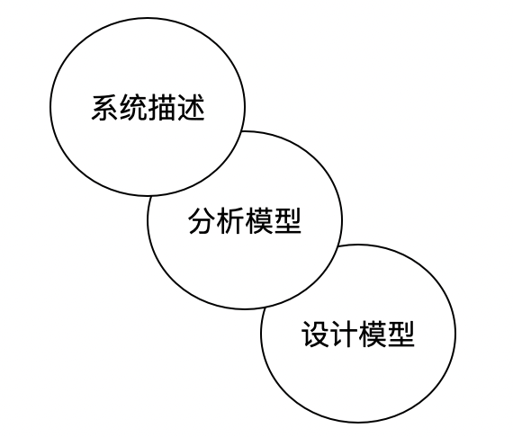

## 1 简介
**概念：需求建模**使用文字和图表综合的形式，以相对容易理解的方式描绘需求，更重要的是可以更直接地评审它们的正确性、完整性和一致性。

**人员**：软件工程师(有时被称作分析师)使用从各种利益相关者那里获取的需求来构建模型。

**重要性**：所有利益相关者都可以轻松评估需求模型，从而在尽可能早的时间内获得有用的反馈。然后，在重新定义模型时，它将成为软件设计的基础。

**步骤**：需求建模包含3步：
1. 基于场景建模
2. 基于类建模
3. 基于行为建模

**工作产品**：使用场景(又称为用例)描述了软件功能和用法。此外，可以使用一系列UML图来表示系统行为和其他方面。

**质量保证措施**：必须评审需求建模工作产品的正确性、完整性和一致性。

## 2 需求分析
**需求分析产生软件操作特征的规格说明，指明软件和其他系统元素的接口，规定软件必须满足的约束**。

在需求分析过程中，软件工程师(有时这个角色也被称作分析师或建模师) 可以细化在前期需求工程的起始、获取、协商任务中建立的基础需求。

**需求建模动作结果为以下一种或多种模型类型**：
* **场景模型**：出自各种系统“参与者”观点的需求。
* **面向类的模型**：表示面向对象类(属性和操作) 的模型和如何通过类的协作获得系统需求。
* **行为模型**：表示软件如何对内部或外部“事件”做出反应。
* **数据模型**：描述问题信息域的模型。
* **面向流的模型**：表示系统的功能元素并且描述当功能元素在系统中运行时怎样进行数据变换。

这些模型为软件设计者提供信息，这些信息可以被转化为结构、接口和组件级的设计。最终，在软件开发完成后，需求模型(和需求规格说明) 就为开发人员和客户提供了评估软件质量的手段。

上面这些建模方法的流行程度：
* **基于场景的建模**，这项技术在整个软件工程界**非常流行**。
* **基于流和数据建模**，在过去十年，人们已经**不常使用**了。

在整个分析建模过程中，软件工程师的**主要关注点集中在做什么而不是怎么做**。
* 发生哪些用户交互？
* 系统处理什么对象？
* 系统必须执行什么功能？
* 系统展示什么行为？
* 定义什么接口？
* 有什么约束？

**需求模型必须实现三个主要目标**：
1. 描述客户需要什么
2. 为软件设计奠定基础
3. 定义在软件完成后可以被确认的一组需求。

**分析模型在系统级描述和软件设计之间建立了桥梁**:
* 这里的系统级描述给出了整个系统或商业功能(软件、硬件、数据、人员元素)；
* 而软件设计出了软件的应用程序结构、用户接口以及组件级的结构；
* 要注意需求模型的所有元素都可以 直接跟踪到设计模型；通常难以清楚地区分设计和分析模型，有些设计总是作为分析的一部份进行，而有些分析将在设计中进行；
* 关系如下图：

## 3 基于场景建模
尽管有多种方式度量基于计算机的系统或产品的成功与否，但用户满意度仍然居于首位。如果软件工程师了解最终用户(和其他参与者) 希望如何与系统交互，那么软件团队将能够更好地正确描述需求特征并建立有意义的分析和设计模型。

**使用UML对需求进行建模首先要以用例图、活动图和序列图的形式创建场景**。

### 3.1 创建用例
在开始创建软件之前，开发人员需要使用较精确的方法来描述利益相关者与系统的交互。Alistair Cockburn将用例描述为“行为合同”。这种“合同”定义了一个参与者使用基于计算机的系统完成某个目标的方法。换句话说，用例捕获了信息的产生者、使用者和系统本身之间发生的交互。

**用例从某个特定参与者的角度出发，采用简明的语言描述一个特定的使用场景**。在写用例的时候，我们需要回答这些问题：
1. 编写什么？
2. 写多少？
3. 编写说明应该多详细？

**怎么确定编写什么**？两个首要的需求工程工作(起始和获取) 提供了开始编写用例所需要的信息。
* 运用需求收集会议和其他需求工程机制确定利益相关者，定义问题的范围，说明整体的运行目标，建立优先级顺序，概述所有已知的功能需求，描述系统将处理的信息(对象)。
* 开始开发用例时，应列出特定参与者执行的功能或活动。这些可以借助所需系统功能的列表，通过与利益相关者交流，或通过评估活动图(作为需求建模中的一部份而开发)获得。

通常，用例首先用非正式的描述性风格编写。如果需要更正式一些，可以使用结构化的形式重新编写同样的用例。
TODO：例子

描述性用例的一种表达形式是通过用户活动的顺序序列表现交互，每个行动由声明性的语句表示。
TODO：例子

**为了全面理解用例描述功能，对交互操作给出另外的描述是非常有必要的。针对场景中的每个步骤提以下这些问题来评估次要场景和异常处理**：
* 在这一步，参与者能做一些其他动作吗？
* 在这一步，参与者有没有可能遇到一些错误条件？
* 在这一步，参与者有没有可能遇到一些其他行为？
* 在这个用例中是否有某些具有“确认功能”的用例出现？包括引用确认功能，以及可能出现的错误条件。
* 在这些用例中是否有支持功能(或参与者)的应答失败？例如，某个用户动作是等待应答，但该功能已经应答超时了。
* 性能差的系统是否会导致无法预期或不正确的用户活动？例如，一个基于Web或移动的接口应答太慢，导致用户在处理按钮上已经做出了多重选择。这个选择队列最终不恰当地生成了一个出错条件。
* ...

**用例应该注明异常处理，即如果软件能检测出异常所发生的条件就应该马上处理这个条件**。但在某些情况下，异常处理可能拖累其他用例处理条件的开发。

**正式用例的典型描述要点**：
* **情境目标**确定了用例的全部范围；
* **前提条件**描述在用例初始化前应该知道哪些信息；
* **触发器**确定“用例开始”的事件或条件；
* **场景**列出参与者和恰当的系统应答所需要的特定活动；
* **异常处理**用于细化用例时没有涉及的情景；
* 此外，还能包含其他主题，并给出合理的自我解释。

我们可以在使用用户故事创建用例时创建图形化表示，如使用UML用例图。图形化表示可以帮助所有利益相关者更好地理解问题，尤其是在复杂场景的情况下。

每种建模注释方法都有其**局限性**，UML用例方法也不例外。和其他描述形式一样，用例的好坏取决于它的描述者。如果描述不清晰，用例可能会误导或有歧义。**用例关注功能和行为需求，一般不适用于非功能需求**。对于必须特别详细和精准的需求建模情境(例如安全关键系统)，用例方法就不够用了。

## 4 基于类建模

## 5 功能建模
**功能模型处理两个应用程序处理元素，每个元素代表不同层次的过程抽象**：
1. 用户可观察到的功能是由应用程序提供给最终用户的；
2. 分析类中的操作实现与类相关的行为。

**用户可观察的功能**包括由用户直接启动的任何处理功能。例如，金融移动App可以实现各种财务功能(例如，支付抵押贷款的计算)。可以使用分析类中的操作来实现这些功能，但是从最终用户的角度来看，这些功能(更正确地说，这些功能所提供的数据) 是可见的结果。

无论过程抽象的层次如何，**UML活动图**都可以用来表示处理细节。从分析阶段，仅在功能相对复杂的情况下才会使用活动图。UML活动图通过提供特定场景内交互流的图形化表示来补充用例，类似于流程图。

**UML顺序图**可用于行为建模。顺序图还可用于显示事件如何引发从一个对象到另一个对象到转移。一旦通过检查用例确定了事件，建模人员就创建了一个顺序图，即用时间函数表示事件是如何引发从一个对象流到另一个对象。顺序图是用例的简化版本，它表示了导致行为从一个类流到另一个类的关键类和事件。

一旦构建了完整的顺序图，就可以将导致系统对象之间转换的所有事件整理为一组输入事件和输出事件集合(来自对象)。对于将要构建的系统而言，这些信息对于创建系统的有效设计很有用。

## 6 行为建模
**行为模型**显示了软件如何对内部/外部事件或刺激做出响应。对于将要构建的系统而言，这些信息对于创建系统的有效设计很有用。
* **UML活动图**可用于对系统元素如何响应内部事件进行建模；
* **UML状态图**可用于对系统元素如何响应外部事件进行建模。

**生成模型的步骤**：
1. 评估所有的用例，以保证完全理解系统内的交互顺序；
2. 识别驱动交互顺序的事件，并理解这些事件如何与特定的对象相互关联；
3. 为每个用例生成序列；
4. 创建系统状态图；
5. 评审行为模型以验证准确性和一致性。

**识别用例事件**：
* 用例表现了涉及参与者和系统的活动顺序。一般而言，只要系统和参与者之间交换了信息就发生事件。事件应该不是被交换的信息，而是已交换信息的事实。
* 一旦确定了所有的事件，这些事件将被分配到所涉及的对象，对象负责生成事件或识别已经在其他地方发生的事件。

在行为建模中，必须考虑两种不同的状态描述：
1. 系统执行其功能时每个类的状态；
   * **类状态**具有被动和主动两种特征：
     * **被动状态**只是某个对象属性的当前值；
     * 对象的**主动状态**指的是对象进行持续变换或处理时的当前状态。
   * **事件**(有时称为触发器)必须发生以迫使对象做出从一个主动状态到另一个主动状态的转移。
2. 系统执行其功能时从外部观察到的系统状态。

## 参考资料
1. 《软件工程 - 实践者的研究方法》